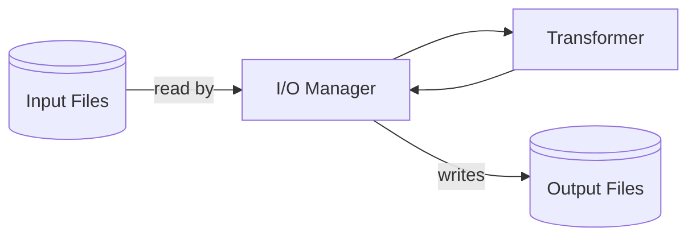

<h1 align=center>
    CCC Python Template
</h1>

> [!NOTE]  
> This is my personal project built to aid me in quickly and efficiently processing CCC challenges. You are welcome to report problems or suggest changes, but in the end I need to be happy with this project.

The general idea behind this project is to offer a simple platform to transform a given input according to the task and automatically write the output back.



To use the I/O manager you simply initiate a new instance, feed it with all your input files and apply a transformer function. The transformer takes one entire input file as the only argument and is expected to return a single string as the output to be written for the given input. An example can be found in [level1.py](level1.py).

```py
m = Manager()
m.load_folder(path=Path("level1"))
m.apply_to_all(func=process_input)
```

> [!TIP]  
> I recommend using [`uv`](https://github.com/astral-sh/uv) to manage your python installations and [`ruff`](https://github.com/astral-sh/ruff) as linter.